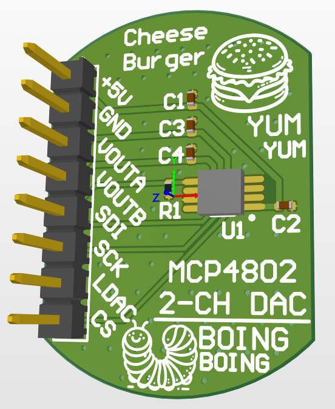
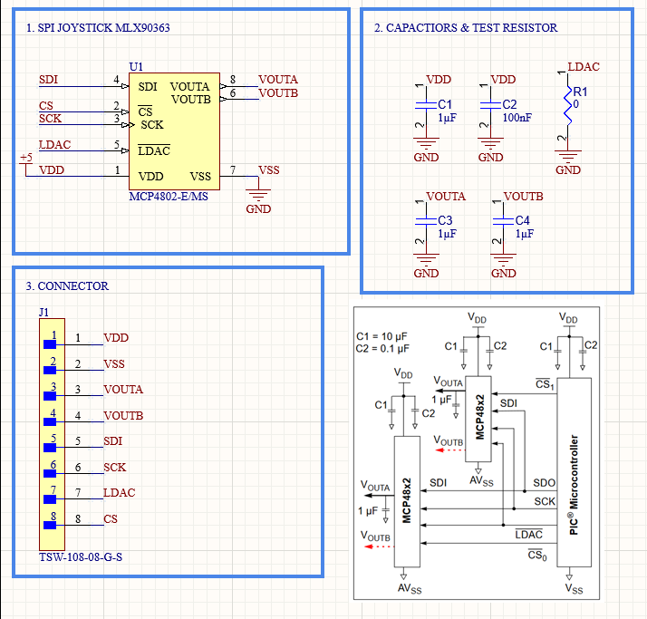

# 2-Channel MCP DAC Project

This project is about creating a breakout module of a 2-channel DAC using the MCP chip.

## Project Overview

It was made to convert digital signals from an spi hall effect joystick to an analog signal.

### DAC Front View

## DAC Schematic View

